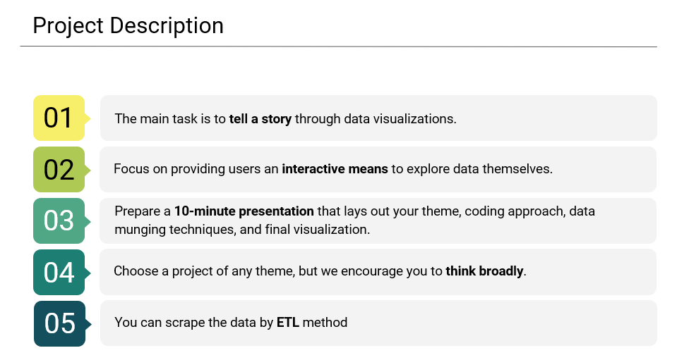
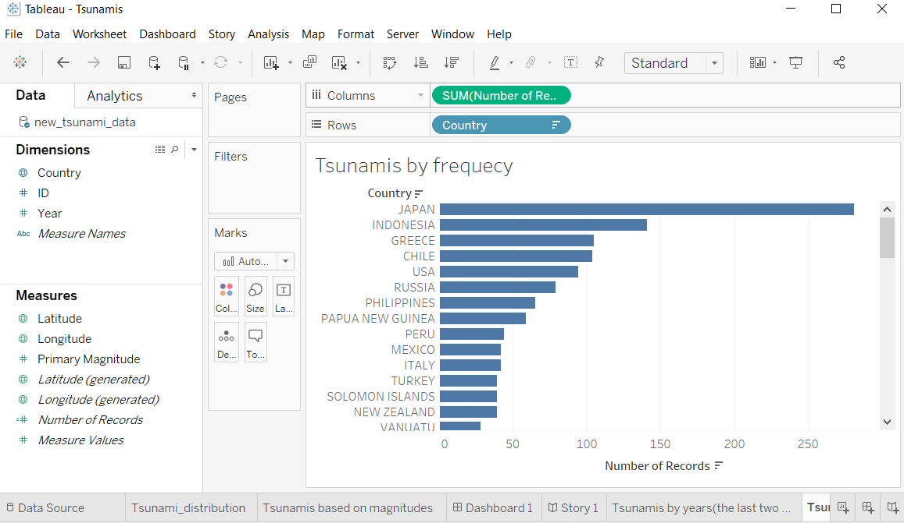
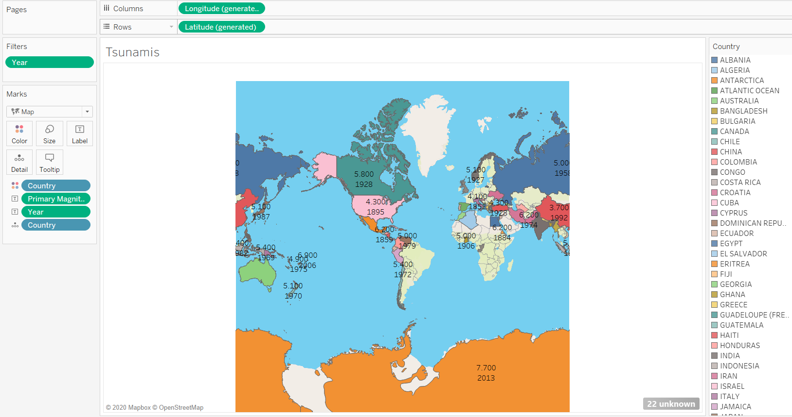
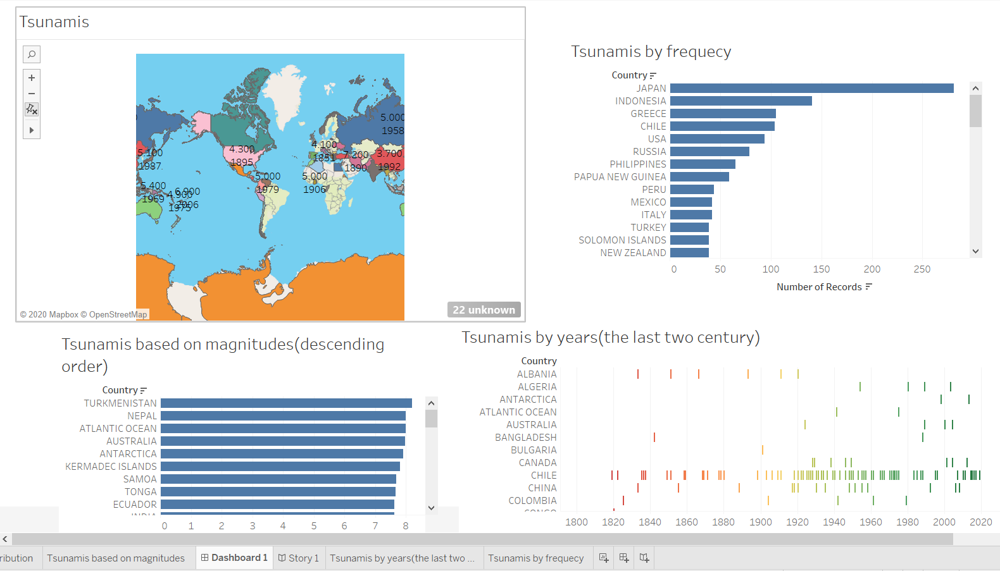

## Project 2_Tableau Challenge

## Project Requirements

## Specific Requirements

Your project should fall into one of the below four tracks: 

#A custom “creative” D3.js project (i.e., a nonstandard graph or chart)

#A combination of web scraping and Leaflet or Plotly

#A dashboard page with multiple charts that update from the same data

#Project must be powered by a data set with at least 100 records.
#Project must include some level of user-driven interaction (e.g., menus, dropdowns, textboxes).
#Final visualization should ideally include at least three views. 

